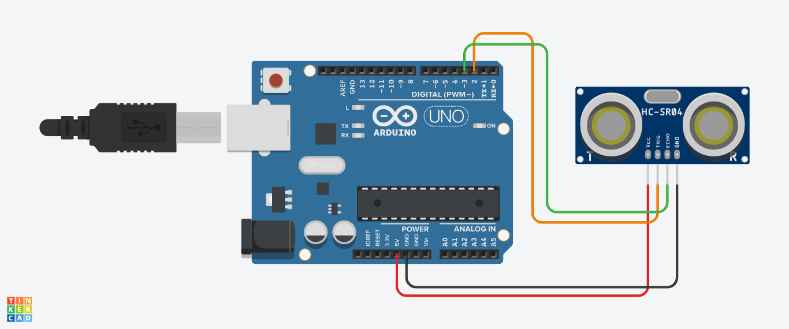

# Sensor HC-SR04 
Uso del sensor ultrasonico HC-SR04 para medir distancia

## Materiales
* 1 x Arduino Uno
* 1 x Sensor HC-SR04
* 1 x Protoboard
* Cables Dupont o puentes para protoboard

## Instrucciones
1) Armar el circuito como se muestra en el Layout.
2) Descargar el codigo .ino y abrirlo en el IDE de Arduino.
3) Revisar que el código este correcto y cargarlo al Arduino.
4) Abrir el monitor serial del IDE de Arduino para ver las lecturas del sensor.
	**Nota:** NO desconectar el cable USB de la computadora ni del Arduino Uno.

## Layout
